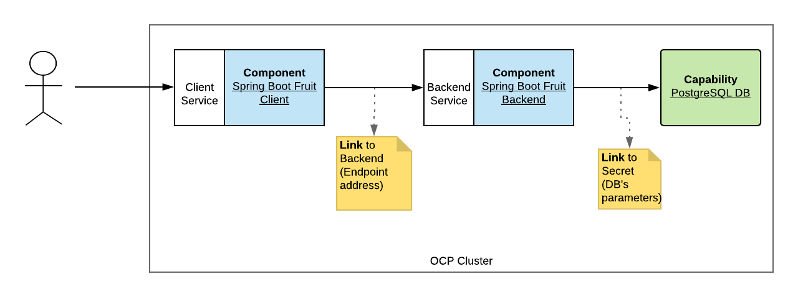

:noaudio:
:scrollbar:
:data-uri:
:toc2:
:linkattrs:

// The following variable can be one of the following:
//   1) cf_order
//   2) guid_grabber
:lab_order_type: guid_grabber

// Guid Grabber dev
//:guid_grabber_url: link:https://www.opentlc.com/gg/gg.cgi?profile=generic_tester[*Guid Grabber*,window="_blank"]

// Guid Grabber prod
:guid_grabber_url: link:https://www.opentlc.com/gg/gg.cgi?profile=generic_rhte[*Guid Grabber*,window="_blank"]

= Lab Setup

.Prerequisites
.. The `ssh` utility installed on your laptop.
+
NOTE: If your network connection is intermittent, consider installing the https://mosh.org/[mosh] utility (`yum install mosh`) as an alternative to the `ssh` utility.

.. Web browser installed on your laptop.
.. Broadband internet connectivity.

:numbered:

== Overview
The project to be developed will contain 2 Spring Boot applications where one is a client
consuming the service exposed by a backend application connected to a PostgreSQL database.

The client will be called `fruit-client-sb` and the backend `fruit-backend-sb` as depicted here after.

Legend:

- [blue]#Blue:# Spring Boot microservice (aka component)
- [yellow]#Yellow:# Link used to inject METADATA
- [green]#Green:# A capability such as a database

== Course Lab Environment

Your lab environment is remote and can be accessed via ssh as well as through your local browser.

=== Order Lab Environment
This section guides you through the procedure to order a virtual machine (VM) for this course.

include::{lab_order_type}.adoc[]

=== Command Line Utilities
Your lab environment commes pre-installed with the following utilities:

. *java* (version 1.8.0)
. *javac* (version 1.8.0)
. *maven* (version 3.5.4)
. *git*
. *podman*
. *buildah*
. *oc* (version: 3.11.82;   This corresponds to the version of OpenShift running in your lab environment).
. *hal*
+
This is a new command line utility that assists in scaffolding of microservice applications runnining in OpenShift.
More information about this utility is found throughout the remainder of this lab.

==== Refresh _hal_ utility for Linux

To ensure that your lab environment uses the latest tag of the _hal_ utility, execute the following in the terminal of you remote lab environment:

. Download and install latest tag of _hal_:
+
----
sudo curl -L https://github.com/halkyonio/hal/releases/download/v0.1.10/hal_0.1.10_Linux_x86_64.tar.gz \
  -o /usr/local/bin/hal_0.1.10_Linux_x86_64.tar.gz && \
  sudo tar -xzf /usr/local/bin/hal_0.1.10_Linux_x86_64.tar.gz \
  -C /usr/local/bin && sudo chmod +x /usr/local/bin/hal
----

. Verify the version:
+
-----
hal version

hal 0.1.10 built with ❤️ by the Halkyon team on '2019-10-01T18:25:46Z' (commit: 3c9f118) running on top of 'oc'
-----

== OpenShift Container Platform

Your lab environment includes Red Hat's OpenShift Container Platform (OCP).

Access to your OCP resources can be gained via both the `oc` CLI utility and the OCP web console.

=== OpenShift Namespaces

. In the terminal of your remote lab environment, authenticate into OpenShift as a non cluster admin user (user1) using the `oc` utility
+
-----
oc login https://master00.example.com -u user1 -p r3dh4t1!
-----

. Set an environment variable called: `OCP_REGION` :
+
-----
echo "export OCP_REGION=`echo $HOSTNAME | cut -d'.' -f1 | cut -d'-' -f2`" >> $HOME/.bashrc

source $HOME/.bashrc
-----

. View existing projects:
+
-----
$ oc get projects --as=system:admin

...

kubedb

...

operators                          Active
tekton-pipelines                   Active
-----

.. *kubedb*
+
This OCP project contains an operator that manages the lifecycle of databases in OpenShift.

.. *operators*
+
This OCP project contains the _halkyon_ operator.

.. *tekton-pipelines*
+
This OCP project contains operators that provide CI/CD infrastructure for your SpringBoot application.

=== OpenShift Web Console

. Point your browser to the URL created by executing the following :
+
-----
$ echo -en "\nhttps://master00-$OCP_REGION.generic.opentlc.com\n\n"
-----

. Authenticate using the following user credentials
.. Username:    user1
.. Password:    r3dh4t1!

== Operators

Your lab environment comes pre-installed with various OpenShift operators.

In this section of the lab, you review these operators.

. *KubeDB*
+
This operator is responsible for the lifecycle of the PostgreSQL database that will be used in your application.
In particular, the operator will create the database and configure its parameters.
+
The source code for this operator can be found link:http://kubedb.com[here].
+
You can view the log file of the operator as follows:
+
----

oc logs `oc get pod -n kubedb --as=system:admin | grep "^kubedb" | awk '{print $1}'` -n kubedb --as=system:admin | more

...

I0924 05:56:29.851996       1 run.go:24] Starting kubedb-server...
I0924 05:56:30.922031       1 lib.go:112] Kubernetes version: &version.Info{Major:"1", Minor:"13+", GitVersion:"v1.13.4+4b86cc5", GitCommit:"4b86cc5", GitTreeState:"clean", BuildDate:"2019-07-24T19:42:25Z", GoVersion:"go1.11.6", Compiler:"gc", Platform:"linux/amd64"}
I0924 05:56:30.926676       1 controller.go:72] Ensuring CustomResourceDefinition...
I0924 05:56:35.745740       1 run.go:36] Starting KubeDB controller
I0924 05:56:35.748846       1 secure_serving.go:116] Serving securely on [::]:8443
----

. *Halkyon Operator*
+
This operator manages the lifecycle of the OpenShift resources from the `Component`, `Link` and `Capability` custom resource definitions.
+
The source code for this operator is found link:https://github.com/halkyonio/operator/[here].
+
You can view the log file of this operator as follows:
+
----

oc logs `oc get pod -n operators --as=system:admin | grep "^halkyon" | awk '{print $1}'` -n operators --as=system:admin | more

...

Log stream paused.
|
69 lines
2019-09-23T15:39:50.342Z	INFO	cmd	Go Version: go1.12.5
2019-09-23T15:39:50.342Z	INFO	cmd	Go OS/Arch: linux/amd64
2019-09-23T15:39:50.342Z	INFO	cmd	Version of operator-sdk: v0.8.1
2019-09-23T15:39:50.342Z	INFO	cmd	halkyon-operator version: unset
2019-09-23T15:39:50.342Z	INFO	cmd	halkyon-operator git commit: 58dbd885
2019-09-23T15:39:50.342Z	INFO	cmd	watching namespace
2019-09-23T15:39:50.482Z	INFO	cmd	Registering Components
2019-09-23T15:39:50.482Z	INFO	cmd	Registering 3rd party resources

...

2019-09-23T15:39:50.687Z	INFO	kubebuilder.controller	Starting workers	{"controller": "component-controller", "worker count": 1}
2019-09-23T15:39:50.687Z	INFO	kubebuilder.controller	Starting workers	{"controller": "capability-controller", "worker count": 1}
----

3. *Tekton Operator*
+
Tekton Pipeline is the building technology deployed on the cluster and responsible to perform s2i builds.
+
The source code for this operator is found here link:https://github.com/tektoncd/pipeline[here].
+
You can view the log file of this operator as follows:
+
----

oc logs `oc get pod -n tekton-pipelines --as=system:admin | grep "^tekton-pipelines-controller" | awk '{print $1}'` \
    -n tekton-pipelines \
    --as=system:admin | more
|

...

{"level":"info","caller":"logging/config.go:100","msg":"Successfully created the logger.","knative.dev/jsonconfig":"{\n  \"level\": \"info\",\n  \"development\": false,\n  \"sampling\": {\n    \"initial\": 100,\n    \"thereafter\": 100\n  },\n  \"outputPaths\": [\"stdout\"],\n  \"errorOutputPaths\": [\"stderr\"],\n  \"encoding\": \"json\",\n  \"encoderConfig\": {\n    \"timeKey\": \"\",\n    \"levelKey\": \"level\",\n    \"nameKey\": \"logger\",\n    \"callerKey\": \"caller\",\n    \"messageKey\": \"msg\",\n    \"stacktraceKey\": \"stacktrace\",\n    \"lineEnding\": \"\",\n    \"levelEncoder\": \"\",\n    \"timeEncoder\": \"\",\n    \"durationEncoder\": \"\",\n    \"callerEncoder\": \"\"\n  }\n}\n"}
{"level":"info","caller":"logging/config.go:101","msg":"Logging level set to info"}
{"level":"warn","caller":"logging/config.go:69","msg":"Fetch GitHub commit ID from kodata failed: open /var/run/ko/HEAD: permission denied"}
{"level":"info","logger":"controller","caller":"controller/main.go:72","msg":"Starting the Pipeline Controller"}
W0924 07:42:06.233565       1 client_config.go:549] Neither --kubeconfig nor --master was specified.  Using the inClusterConfig.  This might not work.
{"level":"info","logger":"controller.taskrun-controller","caller":"taskrun/taskrun.go:100","msg":"Setting up event handlers","knative.dev/controller":"taskrun-controller"}
{"level":"info","logger":"controller.taskrun-controller","caller":"taskrun/taskrun.go:113","msg":"Setting up Entrypoint cache","knative.dev/controller":"taskrun-controller"}
{"level":"info","logger":"controller.pipeline-controller","caller":"pipelinerun/pipelinerun.go:126","msg":"Setting up event handlers","knative.dev/controller":"pipeline-controller"}
{"level":"info","logger":"controller.pipeline-controller","caller":"pipelinerun/pipelinerun.go:138","msg":"Setting up ConfigMap receivers","knative.dev/controller":"pipeline-controller"}
----

[blue]#Congratulations!#
Your lab environment is now ready to use.  Please proceed to the link:TODO[next lab].

== Appendix

=== Optional: OCP cluster admin related tasks

. OCP cluster admin access is provided by switching to the root operating system of your lab environment as follows.
+
-----
$ sudo -i
-----

. Provider the OCP user called _user1_ with the ability to impersonate cluster admin:
+
-----
# oc adm policy add-cluster-role-to-user sudoer user1
-----

. Validate the ability to _impersonate_ cluster admin:
+
-----
$ oc get nodes --as=system:admin

NAME                      STATUS    ROLES            AGE       VERSION
infranode00.example.com   Ready     infra            4d        v1.11.0+d4cacc0
master00.example.com      Ready     compute,master   4d        v1.11.0+d4cacc0
-----

. View details of the ClusterQuota that the _cluster-admin_ has assigned to your OpenShift user:
+
-----
$ oc describe clusterquota quota-rhpam-$OCP_USERNAME --as=system:admin

....

Resource                Used    Hard
--------                ----    ----
configmaps              1       15
limits.cpu              4100m   9
limits.memory           8904Mi  16Gi
persistentvolumeclaims  4       10
pods                    5       20
requests.cpu            750m    4
requests.memory         3160Mi  8Gi
requests.storage        9Gi     40Gi
secrets                 23      50
services                5       50
-----

=== Optional: Provision Lab environment in your own openshift

It is offered to those that are interested in provisioning an environment to support this lab using their own resources.

The lab environment assumes an existing OCP 3.11 installation with cluster admin access and about 24GB of RAM.

The lab environment can be provisioned via the following Ansible:

TO_DO

=== Optional:  Install _hal_ utility on other operating systems

`hal` is a developer-focused tool whose purpose is to make the development of microservice applications using Halkyon even easier.
It does so by guiding the developer in choices as they create microservice components and link them together.

The _hal_ utility is already installed in your lab environment.

The following is provided if you desire the _hal_ utility installed in a different operating system.

===== Binary installation for Mac OS

----
# curl -L https://github.com/halkyonio/hal/releases/download/v0.1.9/hal_0.1.9_Darwin_x86_64.tar.gz | tar -xz -C /usr/local/bin/ && chmod +x /usr/local/bin/hal
----

===== Windows

Download and add it to your `PATH` environment variable:

. Download the `hal_0.1.9_Windows_x86_64.tar.gz` file from the link:https://github.com/halkyonio/hal/releases[GitHub releases page].
. Extract the `hal.exec` file from the compressed archive.
. Add the location of the extracted binary to your `PATH` environment under by example `c:\tools`.

===== Docker

As alternative to using the native binaries for the various OSes, `Hal` commands can also be executed using `docker`.

NOTE: The `hal` image already packages the `oc` client version 4.x.

Execute this command to mount your current directory (where the execution of the lab's scenario will take place) within the container and pass various hal commands.

----
docker run --rm --name hal -v "/path/to/lab/dir:/home/lab" -it quay.io/halkyonio/hal:v0.1.9 <COMMAND>
----

ifdef::showscript[]

Grant the `admin` role to your `user1` user in order to gain access to the different projects, to list the resources created by Halkyon.
+
----
oc adm policy add-cluster-role-to-user admin user1 --as=system:admin
----

endif::showscript[]
