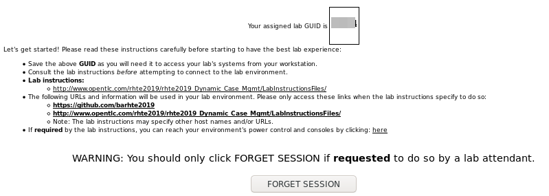

==== Access Lab Environment via GUID Grabber

This section of the lab explains how to access the Red Hat Tech Exchange _GuidGrabber_ to obtain a Globally Unique Identifier (GUID).
This GUID will be used to access a virtual machine that you will use in this course.

. In a web browser, navigate to GPTE's system that assigns lab environments:
+
++++++
<a href="https://www.opentlc.com/gg/gg.cgi?profile=generic_rhte" target="_blank">GUID Grabber</a>
++++++

. Select the *Lab Code* :  `R2026 - Simplify the deployment of your Spring Boot application using our Dev Exp Operator on Kubernetes`.

. Enter the *Activation Key* provided by your instructor.

. Enter your *E-Mail Address*.

. Click *Submit*.

. The resulting page will display your lab's GUID and other useful information about your lab environment.
+

. Open a terminal window

. SSH to your lab environment by specifying your lab environment $GUID in the following commands:
+
-----
$ export GUID=<<your-GUID-from-the-web-page>>

$ ssh lab-user@workstation-$GUID.rhpds.opentlc.com
-----

.. When prompted, enter password: `r3dh4t1!`

. When you are finished with your lab environment at the end of this course, please click *Reset Workstation* so that you can move on to the next lab.
If you fail to do this, you will be locked into the GUID from the previous lab.
+
[NOTE]
Clicking *Reset Workstation* will not stop or delete the lab environment.
